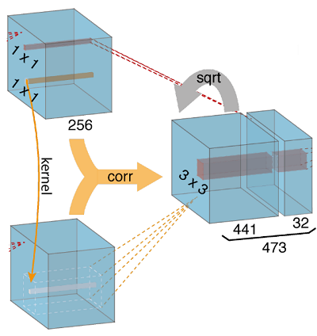

# Pure Pytorch implementation of Correlation Layer

This repository implement a very simple correlation layer using 
pure pytorch, which is widely used in current learning based
optical flow estimation.



## Purpose

The best and official implementation of correlation layer
can be find in [FlowNet2 correlation_package](https://github.com/NVIDIA/flownet2-pytorch/tree/master/networks/correlation_package)

However, the cuda implementation has some limitations, 
for example, didn't support Tensor in CPU, 
lack support for TorchScript, and maybe troublesome compiling the code.
So this repo's implementation uses pure pytorch API, 
which has nature support for back-propagate, TorchScript...

But this implementation may not be as efficient & memory friendly as the cuda implementaion.
Also it currently only supports adjusting the `max_displacement` parameters, 
`stride` and `kernel_size` are strictly limited to 1 (since that already
satisfy most existing flow network)

## Usage

The API is compatiable with official Correlation class. And since there are no
learnable parameter in the layer, this can be integrated into
any network with pertrained weights that use the official implementation  

To use this layer, copy the correlation_torch.py file to your workspace, 
replace the original Correlation package

**Please double check whether the original usage of Correlation has `kernel size == 1`
and `stride1 == stride2 == 1` and `pad_size == max_displacement`**
```python
from correlation_package.correlation import Correlation
```
to
```python
from correlation_torch import CorrTorch as Correlation
```
that should seamlessly switch to the new layer. 


## Sample of test
only for reference. 
```
-----test for: maxdisp=2, kernelsize=1, stride1=1, stride2=1
	official corr time: 0.06024980545043945s, torch corr time: 0.008973121643066406s
	official corr memory: 62.5MB, torch corr cost: 86.9140625MB
	sum of abs err: 0.036905914545059204
	mean of abs err: 5.766549016072986e-09
-----test for: maxdisp=3, kernelsize=1, stride1=1, stride2=1
	official corr time: 0.06620001792907715s, torch corr time: 0.00886392593383789s
	official corr memory: 0.0MB, torch corr cost: 23.4375MB
	sum of abs err: 0.07153448462486267
	mean of abs err: 5.702684990893658e-09
-----test for: maxdisp=4, kernelsize=1, stride1=1, stride2=1
	official corr time: 0.0799558162689209s, torch corr time: 0.015619039535522461s
	official corr memory: 17.5MB, torch corr cost: 49.6484375MB
	sum of abs err: 0.11687405407428741
	mean of abs err: 5.636287436772136e-09
-----test for: maxdisp=5, kernelsize=1, stride1=1, stride2=1
	official corr time: 0.08356404304504395s, torch corr time: 0.02199840545654297s
	official corr memory: 38.1640625MB, torch corr cost: 76.328125MB
	sum of abs err: 0.17250248789787292
	mean of abs err: 5.568908001407635e-09
-----test for: maxdisp=6, kernelsize=1, stride1=1, stride2=1
	official corr time: 0.1089165210723877s, torch corr time: 0.026157140731811523s
	official corr memory: 47.8359375MB, torch corr cost: 95.671875MB
	sum of abs err: 0.2382783591747284
	mean of abs err: 5.507543310301344e-09
```
